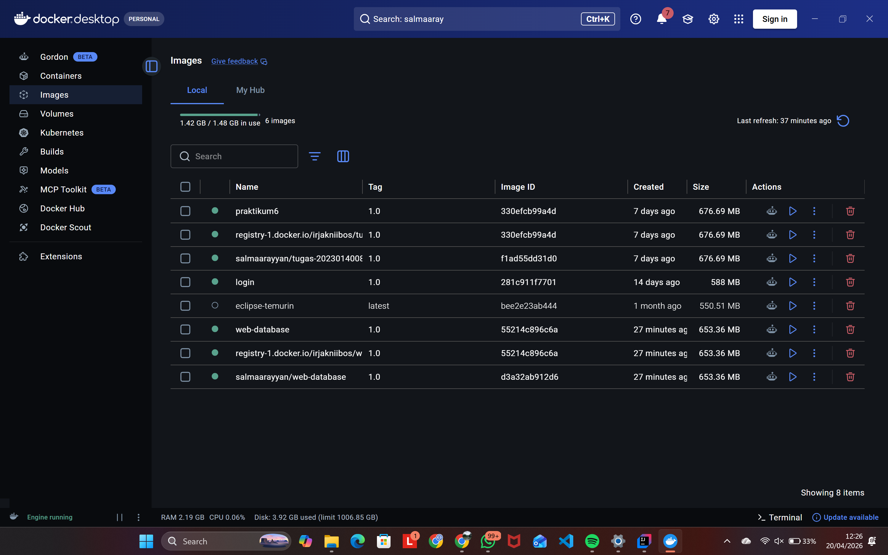
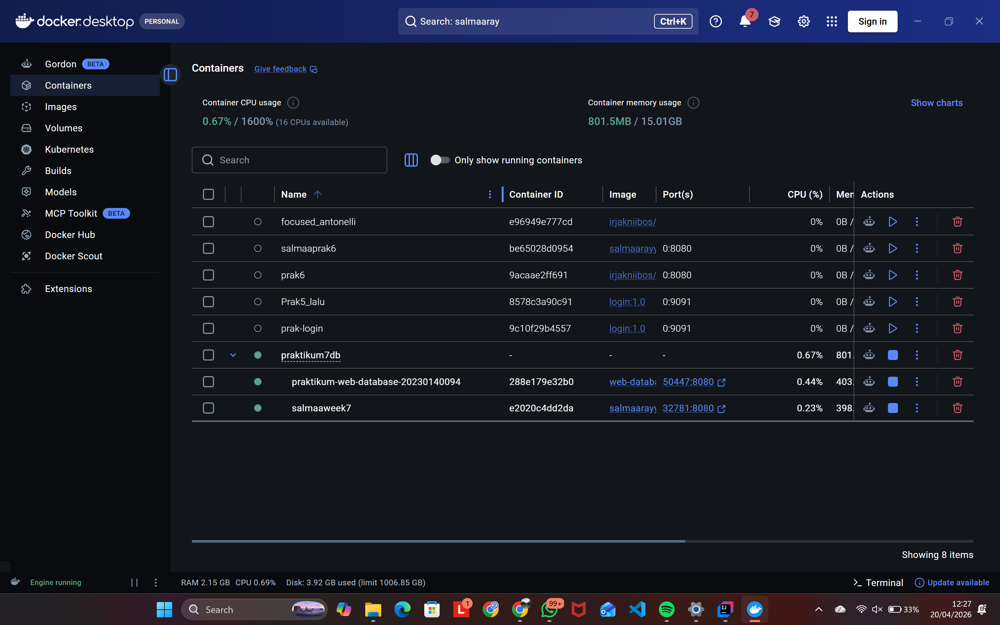
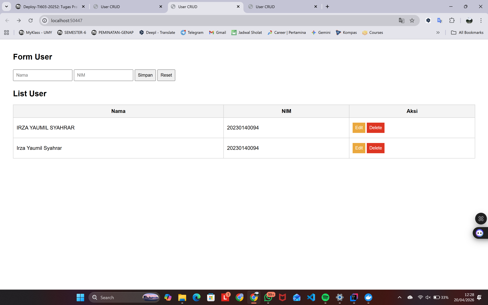
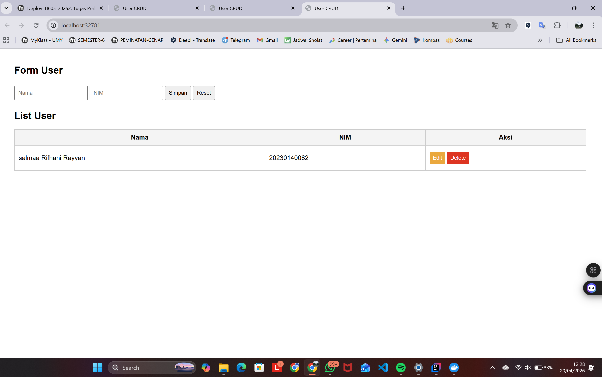

# Tugas Database & Docker
**Irza Yaumil Syahrar:** TugasDBDocker_20230140094

---

## 📋 Deskripsi Tugas
Tugas ini mencakup implementasi Docker untuk manajemen *image* dan *container*, serta kolaborasi antar pengguna dengan melakukan *push* dan *pull* image dari Docker Hub.

---

## 📸 Dokumentasi (Screenshots)

### 1. Halaman Image Docker Desktop
Menampilkan daftar image setelah melakukan **push** image project pribadi dan **pull** image dari rekan tim.

### 2. Halaman Container Docker Desktop
Menampilkan container yang sedang berjalan (running) yang dibuat berdasarkan image milik rekan tim yang telah di-pull.

### 3. Halaman Web Pribadi (Running via Docker)
Halaman form dari project pribadi yang diakses melalui browser saat container sedang berjalan.

### 4. Halaman Web Teman (Running via Docker)
Halaman form dari image milik teman yang berhasil dijalankan di lingkungan Docker lokal.

---